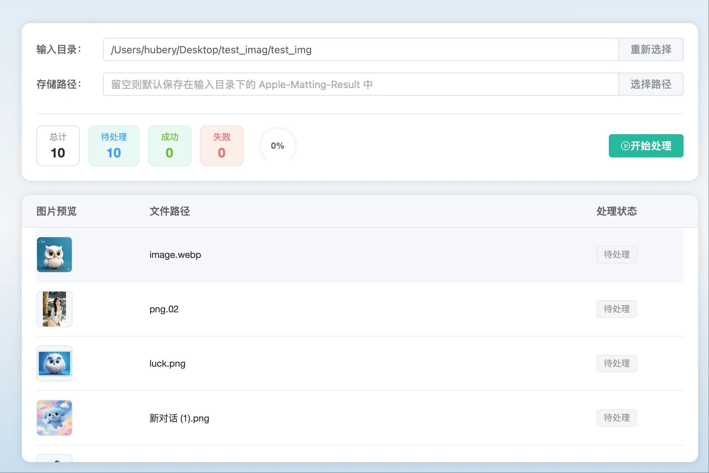
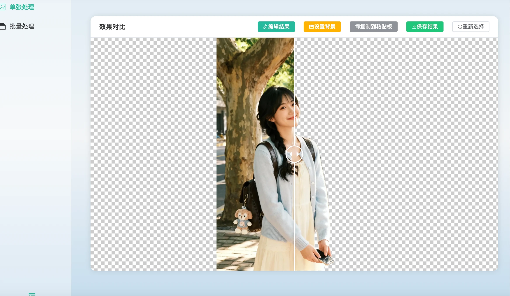
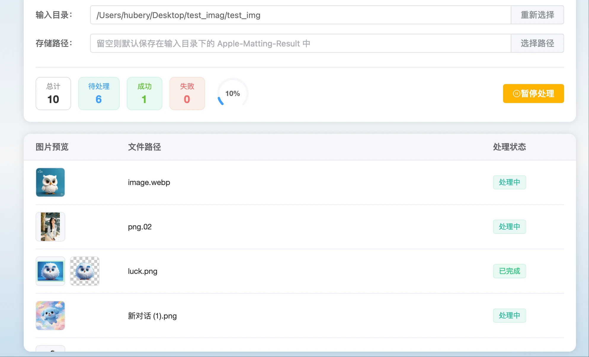
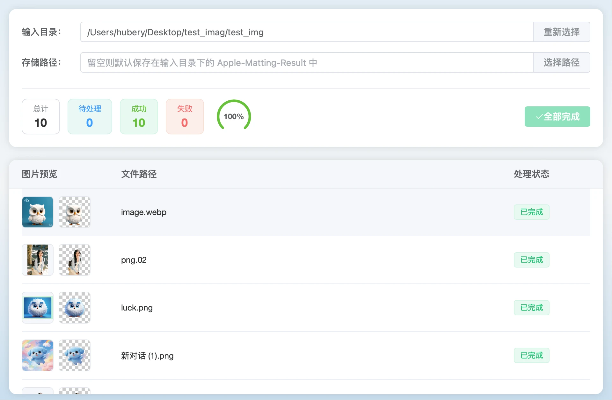

<p align="center">
  
</p>
<h1 align="center">Apple Matting</h1>
<p align="center">A local macOS desktop matting tool built with Tauri, Vue, and Rust.</p>
<p align="center">
  <a href="./README.zh.md">中文文档</a>
</p>
<p align="center">
  <a href="https://github.com/pangxiaobin/apple-matting/releases">
    
  </a>
  <a href="https://matting.lingxiangtools.top/#download">
    
  </a>
</p>
<p align="center">
  <a href="https://matting.lingxiangtools.top/">
    
  </a>
  <a href="./LICENSE">
    
  </a>
  <a href="https://matting.lingxiangtools.top/">
    
  </a>
  <a href="https://tauri.app/">
    
  </a>
  <a href="https://vuejs.org/">
    
  </a>
</p>

Apple Matting is a local desktop background-removal tool built with `Tauri 2`, `Vue 3`, and `Rust`. The current matting backend relies on native macOS capabilities and is designed for fast background removal for portraits, product photos, avatars, and similar images.

Website: <https://matting.lingxiangtools.top/>

## Features

- Single image background removal
- Batch folder scanning and processing
- Supports `JPG`, `PNG`, `WEBP`, and `BMP`
- Before/after comparison preview
- Transparent, solid-color, and gradient backgrounds
- Built-in result editor for erase / restore refinements
- Clipboard copy, save-as, and reveal-in-folder actions
- Optional `apple-matting-cli` command-line interface for local automation
- Chinese and English UI

## Demo


## Screenshots

<p align="center">
  
  
</p>
<p align="center">
  
  
</p>
<p align="center">
  
</p>

## Stack

- Frontend: `Vue 3`, `Vite`, `Element Plus`, `vue-i18n`
- Desktop: `Tauri 2`
- Backend: `Rust`
- Native layer: `Swift + macOS Vision / Core Image`

## Requirements

- macOS 14.0 or later
- Node.js 18+
- `pnpm`
- Rust toolchain
- Xcode Command Line Tools

Note: the matting engine currently integrates with macOS native APIs through `src-tauri/swift/MattingBridge.swift`. Non-macOS platforms will return an unsupported-platform error.

## Quick Start

Install dependencies:

```bash
pnpm install
```

Run in development:

```bash
pnpm tauri dev
```

Build the desktop app:

```bash
pnpm tauri build
```

Build the CLI:

```bash
cd src-tauri
cargo build --release --bin apple-matting-cli
```

Optional: register the CLI in your shell:

```bash
ln -s "$(pwd)/target/release/apple-matting-cli" /usr/local/bin/apple-matting-cli
apple-matting-cli --help
```

Generate icons:

```bash
pnpm tauri icon app_logo.png
```

## Notes

If macOS shows that `apple-matting.app` is damaged after download, run the following command to remove the quarantine attribute and repair it:

```bash
xattr -rd com.apple.quarantine /Applications/apple-matting.app
```

## Project Structure

```text
.
├── src/                # Vue frontend
├── src-tauri/          # Tauri / Rust / Swift native layer
├── public/             # Static assets
├── images/             # Demo assets for README
├── app_logo.png        # App icon source
```

## Usage

### Single Image

1. Open the app and go to `Single Image`
2. Click, drag, or paste an image
3. Start matting
4. Edit, replace background, copy, or save the result

### Batch Processing

1. Go to `Batch Processing`
2. Select the input folder
3. Optionally choose an output folder
4. Start processing and monitor progress
5. Reveal generated files in Finder

### CLI

After building and registering the CLI, process one image from any terminal:

```bash
apple-matting-cli input.jpg -o output.png
```

Supported forms:

```bash
apple-matting-cli input.jpg
apple-matting-cli input.jpg output.png
apple-matting-cli input.jpg -o output.png
apple-matting-cli input.jpg --output output.png
apple-matting-cli input.jpg --crop -o output.png
apple-matting-cli --server --port 8080
```

With only an input path, the CLI writes a sibling file named like `input_nobg.png`. The CLI is a one-shot local command: it processes the image, writes the transparent PNG, prints the output path, and exits.

Add `--crop` to trim the output PNG to the detected foreground bounds.

To expose a simple local HTTP interface, start server mode:

```bash
apple-matting-cli --server --port 8080
```

Then upload one image with multipart field name `file`:

```bash
curl -X POST -F "file=@input.jpg" http://127.0.0.1:8080/matting --output output.png
```

To crop the HTTP output to the detected foreground bounds, include `crop=true`:

```bash
curl -X POST -F "file=@input.jpg" -F "crop=true" http://127.0.0.1:8080/matting --output output.png
```

The HTTP server returns `image/png` on success. Server mode does not add its own queue or concurrency limit; put rate limiting, queueing, authentication, or reverse proxy controls in front of it for production use.

## License

Licensed under `GNU GPL v3.0` (`GPL-3.0-only`). See [LICENSE](./LICENSE).

## Author

- Author: `XIAOBIN`
- Email: `lxt@lingxiangtools.top`
- Website: `https://matting.lingxiangtools.top/`

## Contributing

Issues and pull requests are welcome. By contributing to this repository, you agree that:

- Your contribution will be distributed under the same project license
- You have the legal right to submit the contribution

## Community

- Friendly community: [linux.do](https://linux.do)

## Star History

<a href="https://www.star-history.com/?repos=pangxiaobin%2Fapple-matting&type=date&legend=top-left">
 <picture>
   <source media="(prefers-color-scheme: dark)" srcset="https://api.star-history.com/image?repos=pangxiaobin/apple-matting&type=date&theme=dark&legend=top-left" />
   <source media="(prefers-color-scheme: light)" srcset="https://api.star-history.com/image?repos=pangxiaobin/apple-matting&type=date&legend=top-left" />
   
 </picture>
</a>
